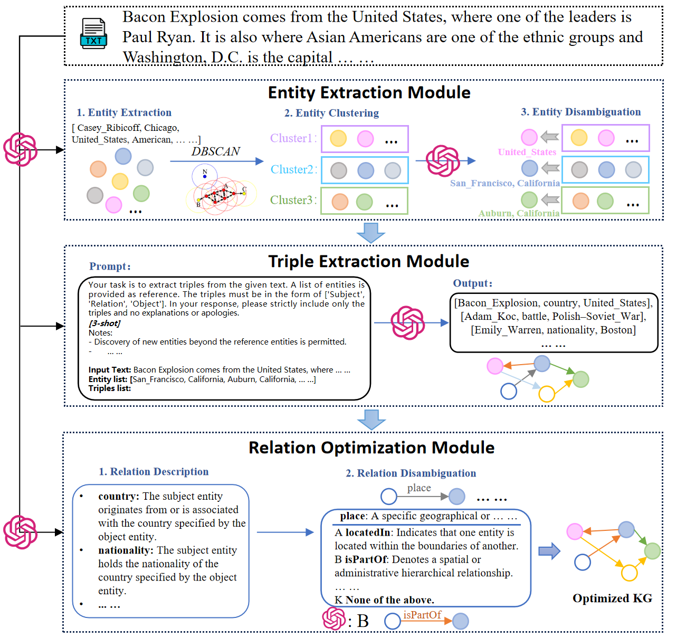

# UKG

🌐 **项目主页** 

论文《UKG: Schema-free Unsupervised Knowledge Graph Construction via Collaborative Entity-Relation Disambiguation》的代码实现。

下图展示了我们提出的UKG整体架构：



## 🏃‍♂️ 快速开始

### 1. pdf->markdown
```python
#配置文件在` magic-pdf.json`中，输出位置` ./output/sufdata`
#1、进入虚拟环境
conda activate mineru

#2、执行mineru,生成md
# 13个pdf,大小15m，mineru跑了1小时10分钟
magic-pdf -p ./0506data/input/ -o ./0506data/pre_output/ -m auto

# 3、提取md和其中的图片，
# 修改extract_table_image.py中的src_base_dir、dest_base_dir
#src_base_dir = "./output/predata"
#dest_base_dir = "./output/sufdata"
python extract_table_image.py

```

###  2、markdown->chunk、标题三元组、图表理解
```python
#1、进入虚拟环境
conda activate InternVL2.5-38B
# 2、启动大模型服务
nohup lmdeploy serve api_server /workspace/LLMFiles/LLMs/Qwen/Qwen2.5-7B-Instruct/ --model-name qwen-7b >md2chunk_qwen-7b.log 2>&1 &
nohup env CUDA_VISIBLE_DEVICES=3 lmdeploy serve api_server /workspace/LLMFiles/LLMs/InternVL/InternVL2-8B/ --model-name internvl2-8b --server-port 23334 > md2chunk_internvl2-8b.log 2>&1 &
# 3、运行py，分块，图表名称和描述生成，保存至csv,
python md2chunk.py
```


## 📁 文件夹说明
```python
/workspace/UKG_Tele/KG_WORK
    --dataset #数据集，包含domain_data、rebel_data、webnlg_data
    --prompt #提示词，包含不同数据集的5个步骤提示词
    --result #输出结果
    --utils #code
    --all_triples_zyq.py #主入口
```

## ⚙️ all_triples_zyq中参数解释
```bash
parser.add_argument('--input_path', type=str, default='/workspace/term_basev2_1203/KG_WORK/src/GraphRAG/dataset/domain_data/domain_data_0620.csv') --输出文本块文件
parser.add_argument('--llm_model', type=str, default='chatgpt-4o-latest') -- 调用api时大模型名字
parser.add_argument('--llm_model_jc', type=str, default='gpt') --大模型简称，用于区分不同大模型，拼接输出文件名字
parser.add_argument('--encoder', type=str, default='/workspace/bge-large-zh-v1.5') --向量化模型
parser.add_argument('--model_path', type=str, default='/workspace/Qwen2.5-7B-Instruct') --调用本地模型时本地路径
parser.add_argument('--index', type=int, default=-1)
parser.add_argument('--use_vllm', type=bool, default=False)   --是否使用大模型vllm加速
parser.add_argument('--use_api_models', type=bool, default=True) --是否使用api
parser.add_argument('--output_version', type=str, default='0623') --输出版本，用于区分时间版本，拼接输出文件名字
parser.add_argument('--label', type=str, default='last') --标签，用于区分消融实验，拼接输出文件名字
```

```plain
python all_triples_zyq.py
```

